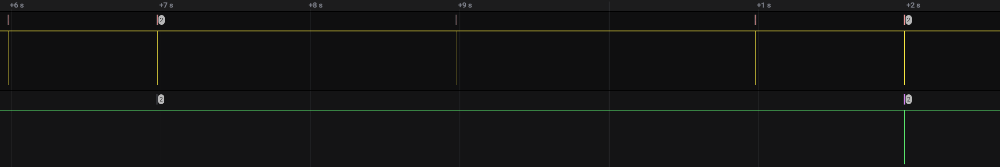

# TS-480-Panel
This is an attempt at documenting the Kenwood TS-480 Transceiver's front panel behavior &amp; reverse engineering of the serial protocol.


### TS-480 Serial Communications

Between panel and the transceiver:
* UART (idle high).
* 57600bps 8N1 (8 bits, no parity, 1 stop bit.
* The majority of the data exchanged between the panel & radio look to be ASCII.

#### Panel Pinout:
```
Pin  Name    Description
1    GND     Speaker ground
2    8V      Control panel power (measured 9v..)
3    GND
4    RX      TTL UART Serial (radio to control head / panel)
5    TX      TTL UART Serial (from control head / panel to radio)
6    AF      Speaker Audio
```

### Communication example between the radio and control panel
Documentation is split into two "chunks", the panel serial data and the transceiver / radio's responses etc.
Primary focus for now is to reverse engineer the panel so it can be interfaced with a "insert radio here" ;)


#### COMMAND -> DATA VALUE -> ACK

Keepalive / ACK sequence:

Panel / Radio

* "ACK to ACK" interval is 5 seconds.
* Internal "ACK" happening on the panel every 2 seconds.
* Radio ACK in poweroff state is `0xFF`, vs normal `0x0D` ACK.
* Panel will respond with `0xFF` & `0x0D` if radio ACK response is `0xFF` & `0x0D`
 
### Knobs
TODO

Values here seem to be made up of:
1. Direction.
2. Speed or increment? Or just value
3. Value


```
0x58 0x30 0x31 0x36 0x33 0x0D
0x58 0x30 0x32 0x30 0x34 0x0D
0x58 0x30 0x32 0x30 0x43 0x0D
0x58 0x30 0x32 0x31 0x35 0x0D

```

Knob adjustments have the following known valid values:
Left: `0x46 0x46`
Right: `0x30, 0x31`

Adjusting AF output (Volume) is contained purely to the panel, no additional serial info is exchanged.

Volume:
```hexdump
0x56, 0x30, 0x31, 0x0D
0x56, 0x30, 0x32, 0x0D
0x56, 0x30, 0x33, 0x0D
0x56, 0x30, 0x34, 0x0D
0x56, 0x30, 0x35, 0x0D
0x56, 0x30, 0x36, 0x0D
```

SQL (Squelch): `0x57`

**RIT/XIT Knob**

Left: 
```
Cmd  State Value Ack
0x55 0x46  0x46  0x0D
0x55 0x46  0x44  0x0D
0x55 0x46  0x45  0x0D
0x55 0x46  0x46  0x0D
```
Right:
```
Cmd  State Value Ack
0x55 0x30  0x31  0x0D
0x55 0x30  0x32  0x0D
0x55 0x30  0x34  0x0D
0x55 0x30  0x35  0x0D
0x55 0x30  0x33  0x0D
```

**Multi & IF-Shift knob**

Multi left:
```
0x54 0x46 0x46 0x0D

```
Right:
```
0x54 0x30 0x31 0x0D
```

If Shift:

"value" is dependent the physical speed the knob is adjusted.

**VFO knob**


### Buttons:
Buttons that are "single action" still will produce a button pressed & released sequence.
Long press buttons use the command but have a different pressed value, instead of pressed: `0x31` it is `0x33`
A long pressed button when released has the same sequence as normal, no special indication that SPLIT is turned off or on from the panels POV.

A button can have 3 values: down: `0x31`  up: `0x30` long press: `0x33`
All button presses or commands are always suffixed with a `0x0D`

```hexdump
Button     Byte  Comment
CL         0x4D
XIT        0x4F
RIT        0x4E
TF-SET-U   0x51
TF-SET-D   0x50
Multi      0x54  
IF-Shift   0x58 
QMI        0x4B  Long press: M.IN
QMR        0x4C  Long press: M>VFO
A/B        0x4A  Long press: M/V
A=B        0x49  Long press: Split
Menu       0x47  Long press: F.Lock
MHz        0x48  Long press: M.STP
FIL        0x42  Long press: NAR
BC         0x43  CW.T in CW mode.
DNL        0x40
NR         0x41
Fine       0x44  Long Press: STEP
CH3        0x36
KEY        0x39
PROC       0x3B
ENT        0x3F
CH2        0x35
MIC        0x38
VOX        0x3C
AGC        0x3E
CH1        0x34
PWR        0x37
NB/T       0x3A
MTR        0x3D
On/Off     0x30
PF         0x32 
ATT/PRE    0x32
AT         0x33 Has long press state also
```